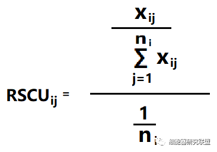

# 笔记
## 7月4日
### 1 假基因（Pseudogenes）
+ 定义

一类染色体上的基因片段，假基因的序列通常与对应的基因相似，但至少是丧失了一部分功能（基因不能表达或者编码的蛋白质没有功能）

+ 形成原因

1、突变导致编码区提前出现终止密码子、移码突变（frameshift）

2、RNA逆转录并整合到DNA上

+ 注

长期以来生物学家们认为假基因是没有功能的垃圾DNA。
近年来的研究还表明假基因和其他非编码片段一样，拥有调控基因表达的功能。
假基因的调控作用对维持生物体的生理活动有着重要意义，一部分假基因在某些疾病的发展中也扮演着重要角色

### 2 直系同源（Orthologs）和旁系同源（Paralogs）

+ 同源（Homologs）

来源于共同祖先的相似序列为同源序列。
也就是说，相似序列有两种，一种是来源于共同祖先的，那么他们可以叫同源，另一种不是来源于共同祖先的，那么他们尽管相似也不能叫同源。
第二种情况出现的概率虽然低，但还是存在的，所以相似序列并不一定是同源序列。同源又分为三种，直系同源，旁系同源和异同源。

+ 直系同源（Orthologs）

是指来自于不同物种的由垂直家系，也就是物种形成，进化而来的基因，并且典型的保留与原始基因相同的功能。
也就是说，随着进化分支，一个基因进入了不同的物种，并保留了原有功能。
这时，不同物种中的这个基因就属于直系同源。直系同源强调的是在不同的基因组中.

+ 旁系同源（Paralogs）

同一物种中的来源于基因复制的基因，可能会进化出新的但与原功能相关的功能来。
旁系同源强调的是在同一基因组中的横向加倍。

+ 异同源（Xenologs）

通过水平基因转移，来源于共生或病毒侵染所产生的相似基因。
异同源的产生不是垂直进化而来的，也不是平行复制产生的，而是由于原核生物与真核生物的接触，比如病毒感染，在跨度巨大的物种间跳跃转移产生的。

## 7月5日
### 进化树的Bootstrap值
Bootstrap值即自展值，可用来检验所计算的进化树分支可信度。Bootstrap几乎是构建系统进化树一个必须的选项。一般Bootstrap的值>70%，则认为构建的进化树较为可靠。如果Bootstrap的值太低，则有可能进化树的拓扑结构有错误，进化树是不可靠的。

Bootstrap值是指根据所选的统计计算模型，设定初始值1000次，就是把序列的位点都重排，重排后的序列再用相同的办法构树，如此让模型计算并绘制1000株系统发育树，这是命令阶段产生的。如果原来树的分枝在重排后构的树中也出现了，就给这个分枝打上1分，如果没出现就给0分，这样给进化树打分后，每个分枝就都得出分值。系统发育树中每个节点上的数字则代表在命令阶段要求的1000次进化树分析中，有多少次。重排的序列有很多组合，值越小说明分枝的可信度越低，最好根据数据的情况选用不同的构树方法和模型。

### 密码子偏好性计算
+ 相对同义密码子使用度（relative synonymous codon usage，RSCU）

编码同一氨基酸的密码子使用的实际频率与理论频率的比值，理论频率就是编码该氨基酸的密码子种类的倒数（每个密码子出现的频率相同）。

公式中，Xij是编码第i个氨基酸的第j个密码子出现的次数，ni是编码第i个氨基酸的同义密码子数量。即分子是某一个同义密码子的使用次数，分母是预期出现的次数。

如果密码子使用没有偏好，则该密码子的RSCU值等于1。当某一密码子的RSCU值大于1，则表明其的使用频率相对较高。

