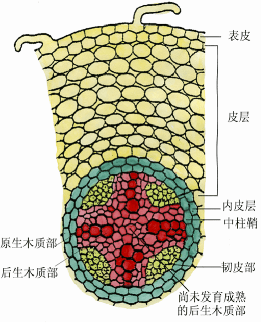
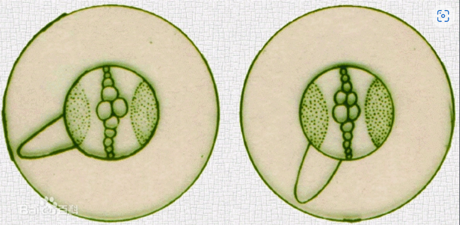
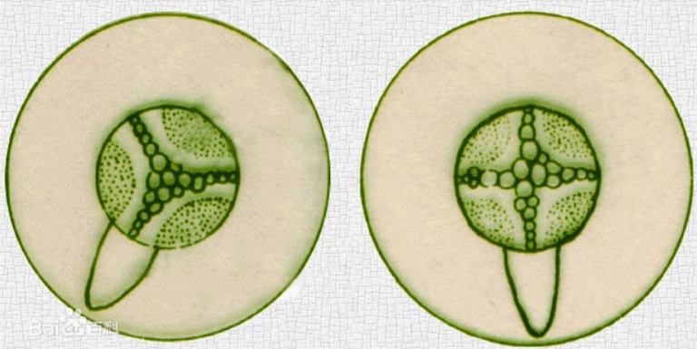
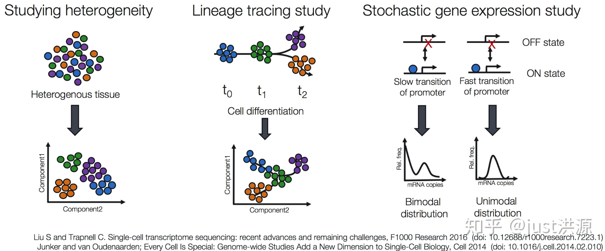
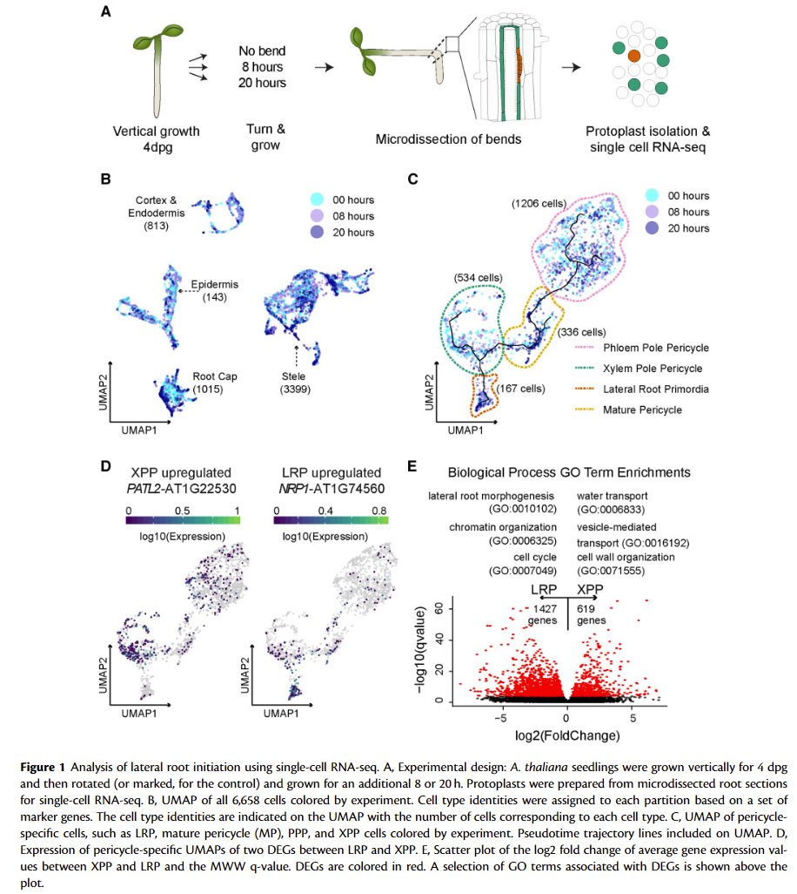
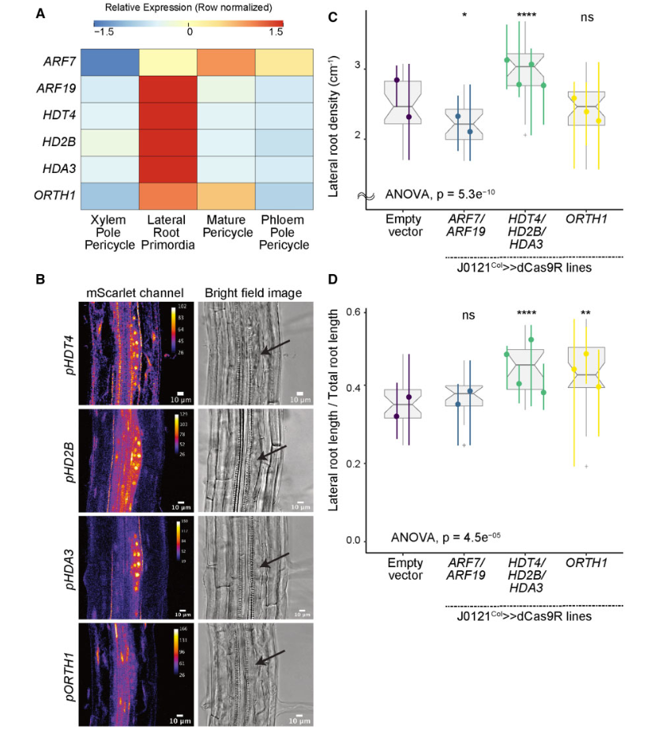
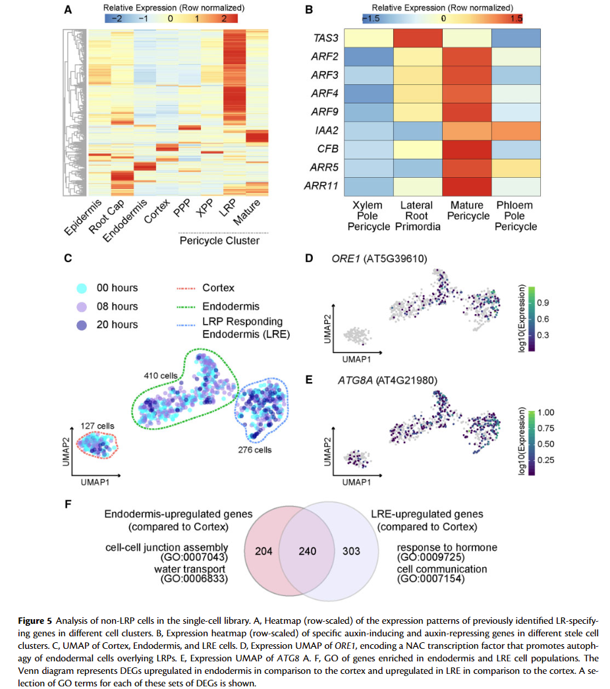

# A single-cell view of the transcriptome during lateral root initiation in Arabidopsis thaliana
## 一、背景
### 1.1 侧根（lateral root）的发生
当侧根开始发生时，中柱鞘的某些细胞（脱分化，进行平周分裂，形成内外两层细胞；外层细胞再平周分裂一次，一共形成三层细胞，这三层细胞组成了侧根原基）开始分裂。
最初的几次分裂是平周分裂，结果使细胞层数增加，因而新生的组织就产生向外的突起。
以后的分裂，包括平周分裂和垂直分裂是多方向的，这就是使原有的突起继续生长，形成侧根的根原基（lateral root primordium, LRP）的分裂，生长，逐渐分化出生长点和根冠。
生长点的细胞继续分裂，增大和分化，并以根冠为先导向前推进，由于侧根不断的生长所产生的机械压力和根冠所分泌的物质能溶解皮层和表皮细胞，这样，就能使侧根较顺利无阻地依次穿越内皮层，皮层和表皮，而露出母根以外，进入土壤。
由于侧根起源于母根的中柱鞘，也就是发生于根的内部组织，因此它的起源是内起源

根据内木质部脊数的不同,把根分为二原型、三原型等，二原型根中，侧根发生于原生木质部和韧皮部之间或正对木质部（xylem pole pericycle, XPP）。三、四原型发生在正对木质部地方，多原型则正对韧皮部。

## 二、工具
### 2.1 细胞分类分析（Cell sorting analyses）
在进行蛋白磷酸化过程的分析、脂肪摄取、肿瘤研究和干细胞分化的过程中，需要对细胞进行区分，以辨认和分析磷酸化蛋白、脂肪细胞、分化的干细胞等。

细胞分类检测模块能够检测双荧光标记的标本，可以用一个荧光标记标记所有细胞核，同时使用另一种荧光标记来标记感兴趣的成分，如细胞核、胞浆或存在于胞核和胞浆内的蛋白。该方法分析方法成熟，速度快，相比传统的流式细胞仪的分析所需细胞更少，且能够得到两个波长下所有细胞的特性和分类。这里可以用此方法来寻找侧根发生的细胞，相比之下，RNA-seq显得更加的简便。

### 2.2 单细胞RNA-seq（Single cell RNA-seq, scRNA-seq）
单细胞RNA测序技术提供了在单细胞水平观测基因表达的方法，可以更好地研究这些组织及其中存在的不同类型的细胞。

应用：

+ 研究一个组织中到底存在哪些种类的细胞
+ 识别未知或少见的细胞类型或状态
+ 阐明在分化过程或时间及状态变化中基因表达的改变
+ 找出在不同条件下（如加药组和疾病组）在某一特定类型的细胞中差异表达的基因
+ 探究一种细胞类型之间基因表达的变化，同时纳入空间，调控和/或蛋白质信息

方法：

+ 探究异质性 (Studying heterogeneity)
+ 谱系路径分析 (Lineage tracing study)
+ 随机基因表达研究 (Stochastic gene expression study)

### 2.3 拟时序分析（Pseudotime analysis）
拟时序分析，即根据不同细胞亚群基因表达量随时间的变化情况，构建细胞谱系发育，但这里的时间并不是真时间，而是一个虚拟的时间，是指的细胞与细胞之间的转化和演替的顺序和轨迹

Monocle是用于ScRNA-seq拟时序分析的经典工具（R包）,Monocle是使用算法来学习细胞状态转变过程中每个细胞必须经历的基因表达变化序列，一旦了解了基因表达变化的整体“轨迹”，Monocle就可以将每个细胞放置在轨迹中的适当位置。
 
### 2.4 统一流形逼近与投影（Uniform manifold approximation and projection, UMPA）
统一流形逼近与投影是一种新的降维技术，其理论基础是黎曼几何和代数拓扑。UMAP的优点在于:(1)能够尽可能多的保留全局结构，（2）耗时更短，（3）对嵌入维数没有限制可以扩展到更大的维度的数据集，（4）可以反映细胞群体之间分化的连续性和组织性

### 2.5 曼-惠特尼-威尔科克森检验（Mann-Whitney-Wilcoxon test, MWW）
不需要假定总体是否服从正态分布的基于两个独立样本总体之间差异以及他们的秩的检验方法。

## 三、结论
### 3.1 图1（单细胞RNA-seq分析侧根的起始）

A：拟南芥幼苗在生长了4小时后旋转分别培养8和20小时，利用重力因素在某一区域富集生长素以模拟侧根发生（参与侧根发生的细胞中生长素水平高）的过程，8小时时转录组出现差异，20个小时后根原基开始形成。以获取与侧根发生相关细胞并进行单细胞转录组分析。

B：实验所获取的6658个细胞的UMAP图。UMAP处理后，这些细胞被分成了四个大类，根据每个类别里面的marker gene对这些细胞群进行分类，通过此方法先将细胞分群，有利于后续探究在侧根发生过程中不同类型细胞所发挥的作用。

C：选取上述分群后获得的3399个中柱细胞（stele）,根据基因表达再对其进行分类，对其中的XPP、LRP、PPP以及成熟的中柱鞘细胞进行UMAP图绘制并绘制拟时序分析曲线。XPP与PPP细胞群都与成熟中柱鞘细胞相连而只有XPP细胞与LRP细胞相连，说明XPP细胞时LRP细胞的的前体细胞。

E：XPP与LRP细胞群之间基因表达分析，由于LRP样本量较少，使用MWW检验显著性差异，并对红色的差异表达基因进行GO分析。结果显示差异表达的基因与侧根的形态发生有着关系，除此之外还与水转运、囊泡介导、染色质结构、细胞周期的转运等相关，推测这些功能可能与侧根的形成相关。

### 3.2 图2（染色质修饰候选基因的验证实验）

A：对XPP、LRP、PPP以及成熟的中柱鞘细胞群中*ARF7, ARF19, HDT4, HD2B, HDA3*以及*ORTH1*中基因表达差异的热图。发现在LRP中，与组蛋白脱乙酰化相关的基因（*HDT4, HD2B, HDA3*）表达量显著上升，推测侧根的发生可能与染色质的结构相关；与减少DNA甲基化相关的基因*ORTH1*在LRP中也有表达量上升的现象。

B：早期 LRP 中候选基因转录报告基因的共聚焦显微镜图像（左）和相应根原基的明场图像（右）。进一步验证了图A中的结论。

C：使用J0121Col >> dCas9R沉默*HDAC*的表达，AVOVA = 方差分析。并转入不同基因的质粒，观察拟南芥侧根密度的情况，在同时抑制了这三个基因之后，转入与生长素相关的基因（*ARF7,ARF19*）并未改善侧根密度减少的情况，再转入与组蛋白脱乙酰化以及DNA脱甲基化相关的基因之后，侧根密度减少的情况得到了改善，并且组蛋白脱乙酰化基因对侧根密度影响最大。

D：在C的基础上，观察了不同基因与侧根长度/总根长的比值情况。结果显示三种转入的基因均促进了侧根的伸长，其中组蛋白脱乙酰化基因对拟南芥侧根伸长的影响最为显著。

### 3.3 图3、4
与图2方法相同，探究了细胞周期调节相关基因、干性（stemness）相关基因对于植物侧根生长的影响，结果显示*CYCLIN-DEPENDENT PROTEIN KINASE INHIBITORS 6 and 11*以及*PLETHORA 3*（调节生长素在主根中的分布）对侧根的生长发育影响较大

### 3.4 图5（非 LRP 细胞群响应侧根起始而经历转录变化和命运转变）

A：侧根特异基因（LR-specifying gene，945个）在不同细胞簇中的表达情况。大部分特异的基因在LRP中搞表达，但是在其他细胞簇中也存在着一些高表达情况，说明侧根的发生是多中细胞共同相互作用过的结果；在LRP中表达量较高的基因，在内胚层、皮质和PPP细胞中存在着表达量下降的现象，说明了这些基因具有细胞的特异性；不同基因簇中的基因在不同的细胞群中具有相似的表达模式。

B：不同中柱细胞簇中特定生长素诱导和生长素抑制基因的表达热图。ARF2、ARF3 和 ARF4 在成熟周环细胞群中的表达高于 XPP 群，并且它们在 PPP 细胞中也表现出相对较高表达，相比之下，这些基因在XPP中却表现着低表达，说明他们可能抑制生长素反应，抑制成熟中柱鞘与PPP细胞群中的侧根发生，以保证侧根之间适当的间距。

C：对之前获得的813个皮层和内皮细胞（cortex and endodermis cells）重新聚类之后的UMAP图。其中有127个细胞表达cortex marker genen被归纳为cortex，而有410个细胞被归为Endodermis,除此之外还有267个细胞（LRE），他们从内皮细胞群中分离，并且大部分来自于20h的幼苗，他们可能参与了侧根的形成？

D,E：上述细胞群体中*ORE1*与*ATG8A*基因的表达情况。ORE1是编码程序性细胞死亡的正调节因子；*ATG8A*为自噬标记基因，结果显示这两种基因在LRE细胞群中高表达，推测这两种基因的表达导致细胞的死亡以为侧根的生长腾出空间。

F：通过与cortex比较（reduce a strong signature of cortex-associated genes in the endodermis）分别获得endodermis和LRE中差异表达（上调）的基因，对这两部分基因做韦恩图后对各自特有的基因进行GO分析。结果显示，endodermis中特有的基因与细胞连接与水的转运相关而LRE特有的基因与激素反应以及细胞间通讯有关。

