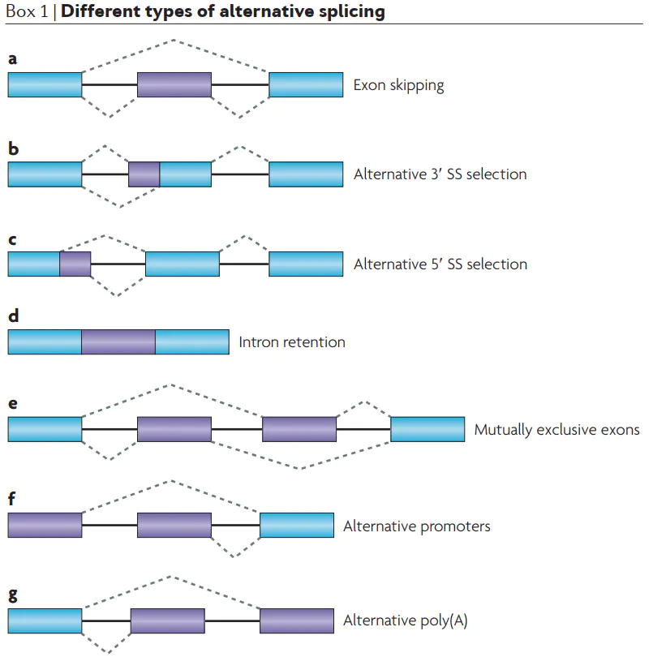
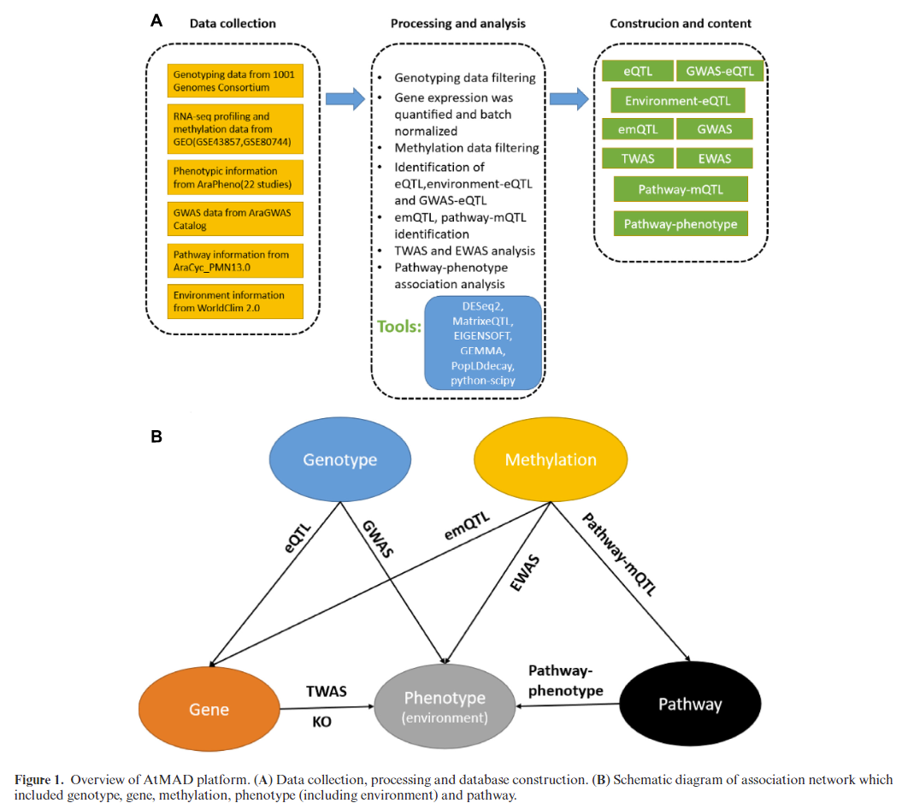
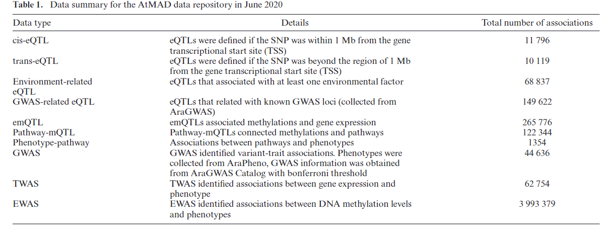
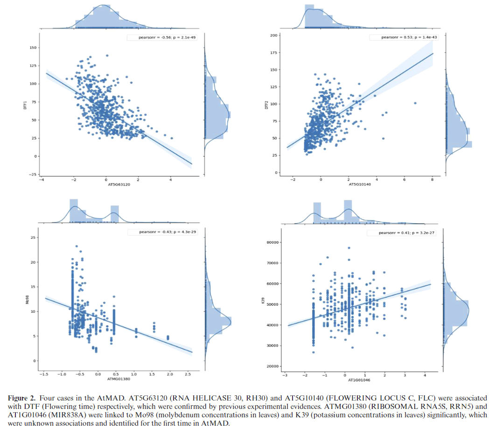

# AtMAD: Arabidopsis thaliana multi-omics association database
## 一、背景
### 1.1 表达数量性状基因座（Expression Quantitative Trait Loci，eQTL）
eQTL表示能控制数量性状基因表达水平高低的那些位点（大部分都为SNP）。一般而言，eQTL主要分为两类：

（1）顺式eQTL（cis-eQTL）：它主要是指与所调控基因相距较近的eQTL，一般多位于所调控基因的上下游1Mb区域；

（2）反式eQTL（trans-eQTL）：与cis-eQTL恰恰相反，反式是指距离所调控基因位置比较远的eQTL，有时候距离甚至超过5Mb。

### 1.2 [表达甲基化数量性状基因座（Expression Methylation Quantitative Trait Loci，emQTL）](https://www.nature.com/articles/s41467-017-00510-x)
DNA甲基化和基因表达量之间的关系

### 1.3 甲基化数量性状基因座（Methylation Quantitative Trait Loci，mQTL）
对于连续型样本性状（Quantitative trait），GWAS通过回归分析，寻找与该性状呈显著关联的SNP位点。这些SNP位点称为“数量性状位点”（Quantitative trait loci；QTL）。当上述连续性状就是甲基化水平（Beta值）时，所得显著关联位点就称为mQTL（Methylation quantitative trait loci）。

mQTL以分析cis-mQTL为主，即利用某基因附近CpG位点甲基化水平Beta值作为因变量，筛选该基因处上下游W Mbase的染色体区域内的所有SNP变异作为自变量，逐一对该范围内的各个SNP位点S与甲基化水平M进行回归分析，从而得到与某基因甲基化水平显著相关的SNP位点。

### 1.4 可变剪接（Alternative Splicing，AS）
从一个mRNA前体中通过不同的剪接方式（选择不同的剪接位点组合）产生不同的mRNA剪接异构体的过程。

ES（Exon skipping，外显子跳跃）指一个外显子从初始转录物上被剪切掉。如图A所示，基因发生可变剪接形成两种不同的转录本， 第1种转录本比第2种转录组本多一个外显子，我们将这种外显子称为inclusive exon，inclusive exon两侧的两个外显子称为constitutive exon。

A3SS（alternative 3′ splice site，可变的3’端）：基因发生可变剪接形成两种不同的转录本，它们的3'端剪接位点一致但5'端剪接位点不同， 第二种转录本的5'端外显子有所延长。

A5SS（alternative 5′ splice site，可变的5’端）：基因发生可变剪接形成两种不同的转录本，它们的5'端剪接位点一致但3'端剪接位点不同， 第二种转录本的3'端外显子有所延长。

RI（Retained intron，内含子保留）：基因发生可变剪接形成两种不同的转录本， 第2种转录本由retained Intron与两侧的外显子一起形成新的外显子。

ME（Mutually exclusive exons，互斥外显子）：基因发生可变剪接形成两种不同的转录本，两转录本之间相同的外显子称为constitutive exon， 不同的外显子称为inclusive exon，两个inclusive exon不能同时存在与同一转录本中， 只能分别存在于不同转录本中。 这样的可变剪接事件称为Mutually Exclusive Exon。

AP（Alternate promoter，可变启动子）：基因的两个转录本的区别在于第一个外显子不同，这样的可变剪接事件称为Alternative First Exon。

AT（Alternate terminator，可变终止子）：基因的两个转录本的不同之处于最后一个外显子不同，这样的可变剪接事件称为Alternative last exon。

## 二、技术方法

## 三、结论
### 3.1 图1（AtMAD数据库的概况）

A：数据收集、处理和建立数据库的流程。作者首先从不同的数据库或者实验中获得了拟南芥多组学数据，随后通过对不同来源的数据进行标准化处理，以方便后续的关联分析

B：基因型、甲基化、基因、表型（环境）以及通路之间的关系。多组学数据的整合分析为理解生物系统和机制提供了一个全面的前景。

表格：AtMAD数据库中的数据情况。通过关联分析，将不同的组学信息联系起来，为探究拟南芥中的生物学机制提供了新的思路。

### 3.2 图2（AtMAD数据库中的四个例子）

AT5G63120 (RNA HELICASE 30, RH30)和AT5G10140 (FLOWERING LOCUS C, FLC)与开花时间有关（先前实验证明），而ATMG01380 (RIBOSOMAL RNA5S, RRN5)和AT1G01046 (MIR838A) 分别与叶片中Mo98和K39的含量有关（新发现）

横坐标越靠近0，表型状态越明显

