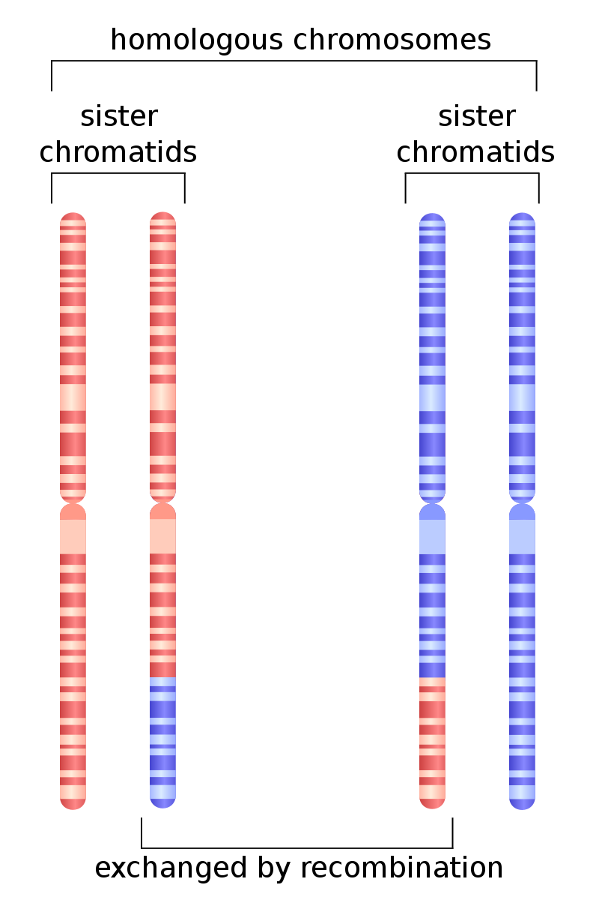
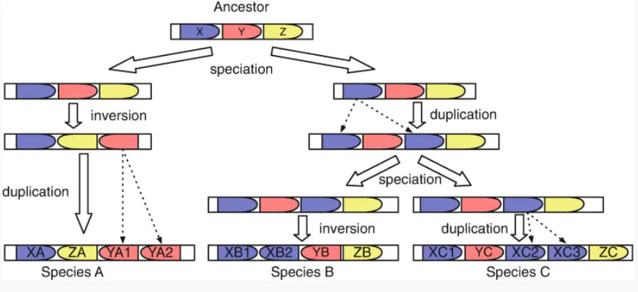
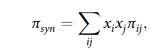
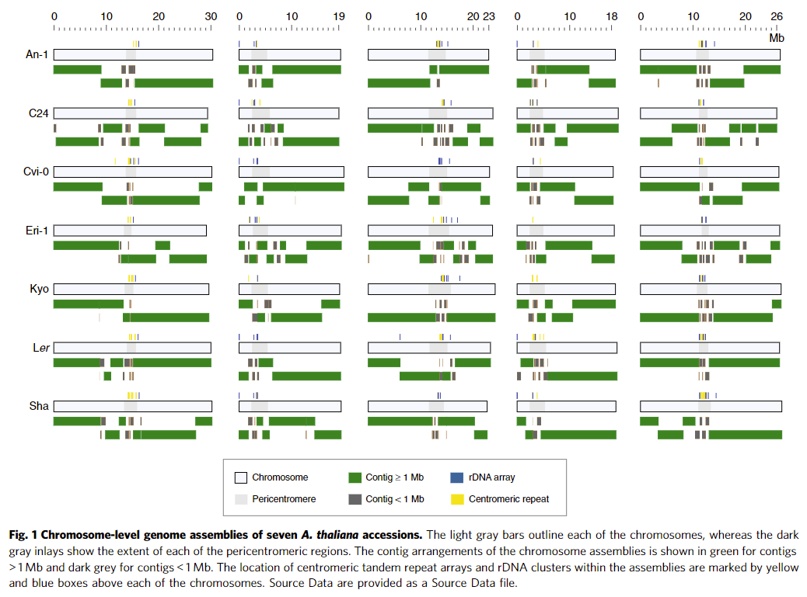
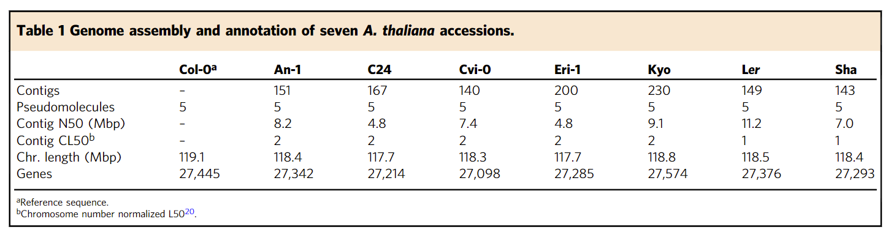
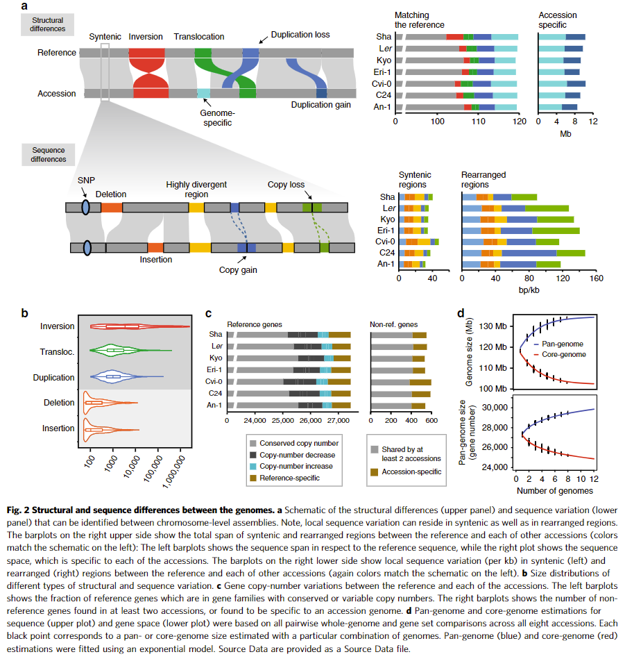
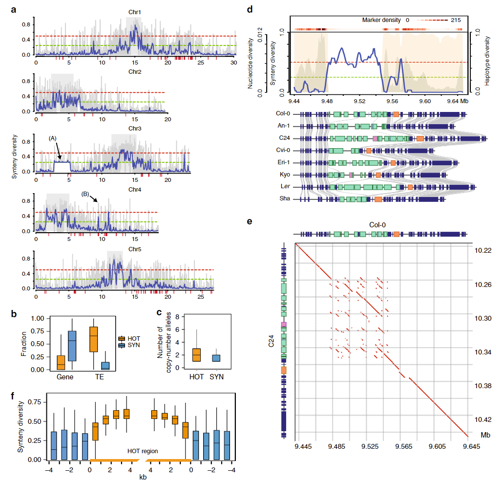
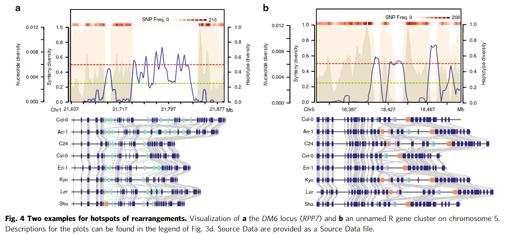
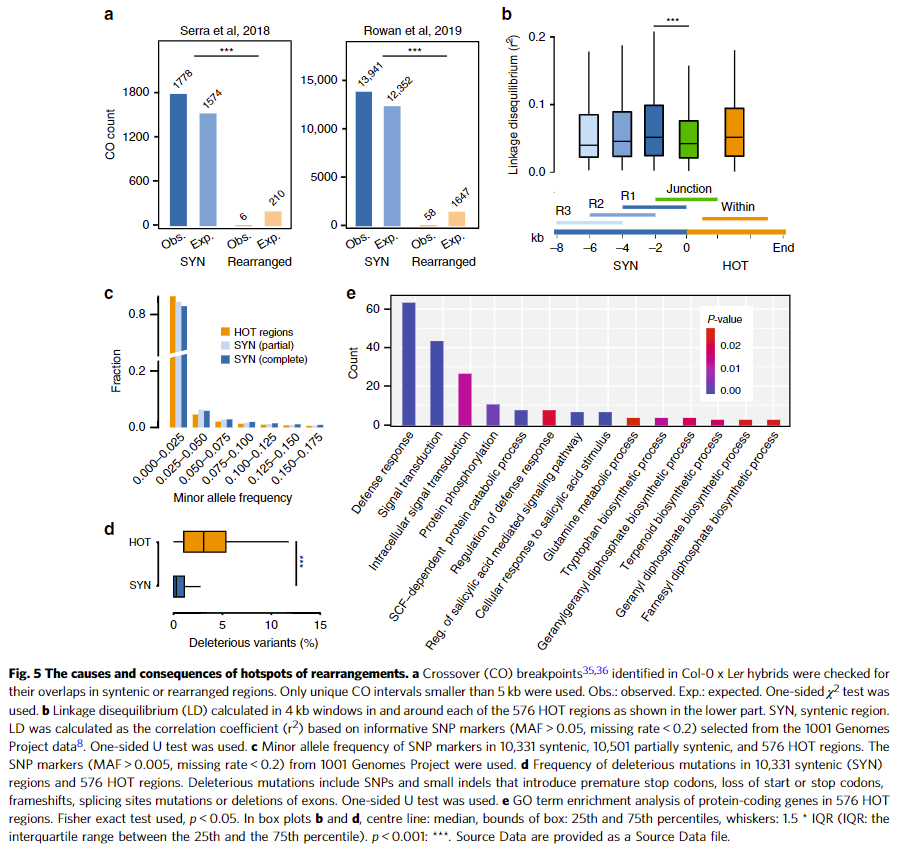

# Chromosome-level assemblies of multiple Arabidopsis genomes reveal hotspots of rearrangements with altered evolutionary dynamics
## 一、背景
### 1.1 同源重组（Homologous Recombination）
+ 概念

发生在非姐妹染色单体之间或者同一染色体上含有同源序列的DNA分子之间的或者分子之内的重新组合。
它在细胞生长、减数分裂、配子形成、物种进化、DNA双链断裂修复、基因组稳定性维持等多方面，起着必需作用。
真核生物体内的同源重组发生于同源重组时期，是染色体互换造成的结果。

### 1.2 共线性（Collinear）
+ 概念

用来描述同一染色体上基因的位置关系，由同一祖先型分化而来的不同物种间基因的类型以及相对顺序的保守性（即基因的同源性+基因的排列顺序）

共线性分析分为两种：（1）编码基因共线性：基于蛋白水平，蛋白质的保守性很高，即使分化较远的物种间也能找到同源基因片段；（2）全基因组共线性：基于DNA水平，其中包含了大量的非编码片段，变异程度即使是在近缘物种间也非常大

共线性片段的大小与物种之间的分化时间有很大关系：分化时间较短的物种间，积累的变异较少，会保留更多从祖先遗传下来的特征；相反的，分化时间较长的物种间由于变异积累而导致共有的特征变少，反而获得较短的共线性片段。

### 1.3 核型（Karyotype）
核型是指染色体组在有丝分裂中期的表型, 是染色体数目、大小、形态特征的总和。在对染色体进行测量计算的基础上, 进行分组、排队、配对, 并进行形态分析的过程叫核型分析。 在用核型式描述一个核型时，第一项是染色体总数（包括性染色体），然后是一个逗号，最后是性染色体。下面是一些核型式的举例：

46,XX　正常女性；46,XY　正常男性；

### 1.4 基因组重排（Genomic rearrangement）
+ 概念

目前，基因组重排大致可以分为四种：反转、移位、转位、合并和分裂。

（1）反转：一条染色体中连续基因序列的倒置

（2）移位：将两条染色体分成两段，相互交换后重新连接形成两条新的染色体

（3）转位：一条染色体上交换两个相邻的基因序列

（4）合并和分裂：两条染色体连接成一条新的染色体；一条染色体断裂成两条新的染色体

### 1.5 N50与L50
N50：分为Contig N50和Scaffold N50,在序列的组装过程中会产生Contig与Scaffold片段，将这些片段相加获得C或者S的总长度。然后将所有的C或者S片段进行从长到短进行排序，当相加的长度达到总长度的一半时S或者C片段的长度。

L50：长度和为N50的contigs或者scaffold个数，随后衍生出了CL50（Chromosome-normalized L50）即每个染色体L50的数量，理想状态下，CL50的值应该为1，代表组装质量差最好。

### 1.6 共线性密度πsyn（synteny diversity）

定量衡量基因组之间的共线性程度，在给定中群内的所有成对基因组比较重发现的非共线位点的平均分数。πsyn的取值从0到1，0表示基因组之间全部共线，而1表示基因组之间完全不共线。πsyn可以在任何给定区域计算；然而，共线性的注释仍然需要在全基因组的背景下建立，以避免同源但非等位基因区域的错误分配。

其中 xi 和 xj 是指序列 i 和 j 的频率，而 πsij 是指序列 i 和 j 之间位置非共线的平均概率。

## 二、方法

## 三、结论
### 3.1 图1（七个拟南芥种质的染色体水平基因组组装）

通过利用三代测序技术（PacBio）结合二代测序对7个种质拟南芥的基因组进行了染色体水平的组装，图片与表格显示，除了染色体着丝粒附近的区域测序质量不太理想（含有较多的小于1Mb的contig,存在大量多拷贝，高度相似的重复序列），其余片段均呈现出较好的组装质量。除此之外，作者还标注出了rDNA(蓝)以及着丝粒重复（蓝）区域，大部分rDNA区域位于染色体的着丝粒区域，也有一部分rDNA存在于染色体末端区域（端粒？，这部分也含有高度重复的序列），rDNA中一般也含有大量的重复序列，在包含了这些重复序列之后，组装得到的染色体的长度在117.7–118.8 Mb，十分接近参考基因组的长度（119.1 Mb）。

### 3.2 图2（基因组之间的结构和序列差异）

A：通过将组装获得的序列与参考基因组对比，来寻找共线性和重排的区域。

可以在染色体水平组装之间识别的结构差异（上图）和序列变异（下图）的示意图。序列变异不仅可以存在于重排区域，还可以存在于共线性区域。右上角的条形图统计了与参考序列相比，新组装的序列中的一些共线性与结构变异情况（左），可以观察到每种种质中都或多或少的存在一些结构变异，并且除了Sha之外，其余6个变异情况类似；除此之外，还统计了每个种质中特异序列（新的序列或者多出的重复序列，左）数量。

右下角的条形图统计了共线性区域与重组区域中序列变异的情况，包含了SNP、缺失、插入、拷贝数量变化或者是高度编译的序列。结果显示，在重组区域的序列差异数量要明显多余共线性区域（共线性区域发挥着重要的功能，产生的变异较少而重组区域使得物种之间多样性的产生，所以存在较多的变异？），这与重排区域的拷贝数多样性有关（copy-gain and copy-loss variation in rearranged regions）

B：不同类型结构和序列变异的大小分布。结构变异的长度覆盖范围十分的广，尤其是倒置这一突变类型，从最小的几百 kb 到最大的几Mb（Sha的3号染色体上中包含了一个2.48Mb大小的倒置），这是否也是产生物种间多样性的原因之一？

C：参考和每个种质之间的基因拷贝数变异。左边的条形图表示参考基因（reference genes）在不同种质中拷贝数的变异情况，右边的条形图表示在参考序列之外的基因的拷贝数变异情况，包括多个种质共有的基因与单个种质特有的基因。结果显示，Cvi0含有较多的特异性基因，并且其中含有的参考基因中，也存在较多的拷贝数减少的情况，是否是因为这些拷贝发生了变异，衍生出新的功能，而形成了“新”的基因（旁系同源？），而在其他种质中基因的分布较为均匀。

D：序列（上图）和基因空间（下图）的泛基因组和核心基因组估计基于所有八个种质的所有成对全基因组和基因组比较。

### 3.3 图3（共线性的定量分析揭示了重排的热点）

A：对8个拟南芥种质五条染色体上的πsyn进行计算（蓝色表示100kb的窗口，每次滑动50kb；而灰色表示5kb的窗口，每次滑动1kb），（A）表示Sha中2.48Mb的倒置区域。结果显示，πsyn在染色体的着丝粒区域较高（共线程度低）而在染色体两臂共线性程度高。

B：10331个共线性区域和576个重组区域的基因和转座元件的密度。结果显示，相比于共线性区域，重组区域虽然含有的基因较少，但是含有较多的转录原件，这些转录原件可能与重组的发生有关。

C：上述不同的区域中可变等位基因拷贝数的变化。相比于共线性区域，重组区域含有更多的可变拷贝数等位基因。这些基因相比于其他基因更容易发生突变。

D：A图中4号染色体（B）箭头所知区域的进一步分析，此区域的共线多样性超过了0.5。结果显示，其中包含了*RPP4/RPP5*基因簇，其中同一抗性基因在不同的种质中存在着不同的拷贝数量（下图绿色方块）。

E：Col-0和C24之间同源区段的比较。结果显示不同的基因拷贝主要是通过正向串联重复和大插入缺失的积累引入的

F：576 个 HOT 区域周围和 1 kb 滑动窗口中的同线性多样性值分布。在HOT周围区域中的基因组保守型还是挺高的。这表明，要么不同的选择机制在 HOT 区域及其附近区域之间引入了明确的边界，要么 HOT 区域是增加串联重复率的特定目标。

### 3.4 图4（另外两个重排热点区域的示例）

突变率的这种局部增加可能是由非等位基因同源重组介导的，这可能是由这些区域的大量局部重复引起的

### 3.5 图5（重排热点的原因和后果）

A：Col-0 x Ler后代中，交叉互换位点与共线性区域与重组区域的关系。结果显示，大部分交叉互换位点都发生在共线性区域而只有少部分位点发生在重排区域这进一步证明了结构变异可以抑制减数分裂重组的猜想（HOT处几乎不会发生减数分裂交叉互换）。

B：在 576 个 HOT 区域中的每一个及其周围的 4 kb 窗口中计算的连锁不平衡 (LD)。在HOT内部以及HOT以外（越靠近HOT区域,LD值越高，重组降低），序列之间的LD值较高，说明他们之间的重组现象发生较少，而在他们的交界之处，LD值相对较低，说明 HOT 区域与周围的单倍型没有密切联系，并且它们几乎不交换等位基因。

C、D：为了证明减数分裂重组的减少是否与有害突变的积累有关，作者统计了10331个共线性区域和10501个部分共线区域以及576个HOT区域中的MAF分布以及有害突变情况。C图中HOT区域相比于共线性区域积累了更多的低MAF突变，这些突变可能是有害突变，D图的数据进一步证明了HOT相比于共线性区域积累了更多的有害突变。

E：因为HOT基因区域的结构多样性与R基因的结构十分相似，所以对576个HOT区域蛋白质编码基因(808基因)的GO富集分析。结果显示，这些基因主要参与防御反应、信号转导和次生代谢物生物合成的基因。

