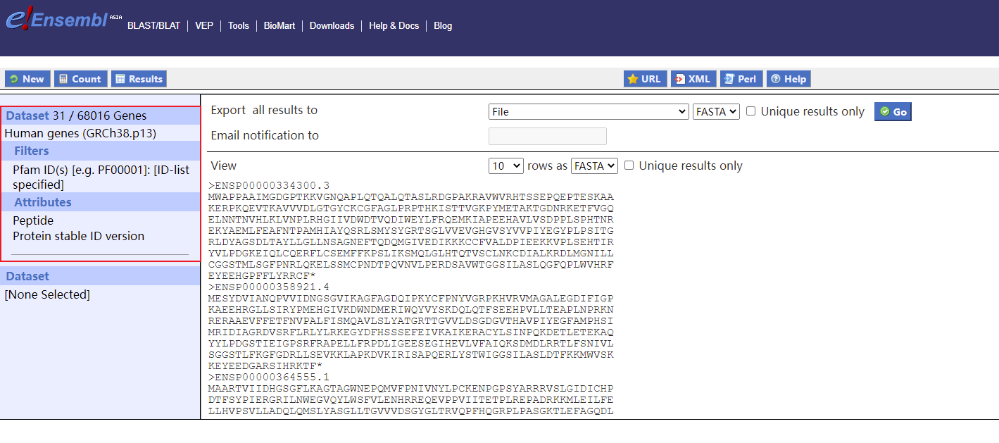
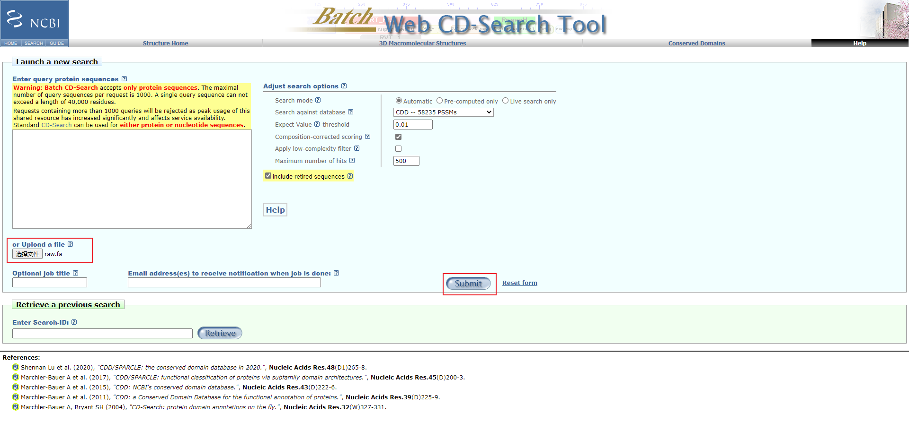

# 1 Identification of Actin Genes

## 1.1 Download genome and protein sequence 
```bash
mkdir sequence
cd sequence

wget http://ftp.ensembl.org/pub/release-106/fasta/homo_sapiens/pep/Homo_sapiens.GRCh38.pep.all.fa.gz
gzip -d Homo_sapiens.GRCh38.pep.all.fa.gz
cat Homo_sapiens.GRCh38.pep.all.fa | grep ">" | wc -l
# 119068

head -n 2 Homo_sapiens.GRCh38.pep.all.fa
#ENSP00000488240.1 pep chromosome:GRCh38:CHR_HSCHR7_2_CTG6:142847306:142847317:1 gene:ENSG00000282253.1 transcript:ENST00000631435.1 gene_biotype:TR_D_gene transcript_biotype:TR_D_gene gene_symbol:TRBD1 description:T cell receptor beta diversity 1 [Source:HGNC Symbol;Acc:HGNC:12158]
#GTGG
```

## 1.2 Download protein sequence that limited to genes with actin domain(Pfam:PF00022)


下载序列并重命名为human.fa
## 1.3 Identify actin genes
> biomart根据PFAM结构域初步筛选了一部分序列，这里利用blastp查找是否有可能的同源物（potential homologs）?
```bash
mkdir blastp
cd blastp
mv human.fa blastp

# blastp
makeblastdb -in ../sequence/Homo_sapiens.GRCh38.pep.all.fa -dbtype prot -parse_seqids -out ./index # 建立索引
blastp -query ./human.fa -db ./index -evalue 1e-10 -qcov_hsp_perc 60 -outfmt 6 -num_threads 6 -out result.tsv

# 统计
cat result.tsv | cut -f 2 | sort | uniq | wc -l
# 108
cat result.tsv | cut -f 2 | sort | uniq > protein_ID.lst
cat ../sequence/Homo_sapiens.GRCh38.pep.all.fa | grep ">" | grep -f protein_ID.lst | wc -l
# 108
cat ../sequence/Homo_sapiens.GRCh38.pep.all.fa | grep ">" | grep -f protein_ID.lst | cut -d " " -f 4 | # 查询基因ID
  sort | uniq | wc -l
# 32
```
+ 第二轮blastp
```bash
cd repeat
mkdir ../blastp_two
cd ../blastp_two

faops some ../sequence/Homo_sapiens.GRCh38.pep.all.fa ../blastp/protein_ID.lst seed.fa

makeblastdb -in ../sequence/Homo_sapiens.GRCh38.pep.all.fa -dbtype prot -parse_seqids -out ./index
blastp -query ./seed.fa -db ./index -evalue 1e-10 -qcov_hsp_perc 60 -outfmt 6 -num_threads 6 -out result.tsv

# 统计
cat result.tsv | cut -f 2 | sort | uniq | wc -l
# 110
cat result.tsv | cut -f 2 | sort | uniq > protein_ID.lst
cat ../sequence/Homo_sapiens.GRCh38.pep.all.fa | grep ">" | grep -f protein_ID.lst | cut -d " " -f 4 | # 查询基因ID
  sort | uniq | wc -l
# 33 
```
+ 第三轮blastp
```bash
cd repeat
mkdir ../blastp_three
cd ../blastp_three

faops some ../sequence/Homo_sapiens.GRCh38.pep.all.fa ../blastp_two/protein_ID.lst seed.fa

makeblastdb -in ../sequence/Homo_sapiens.GRCh38.pep.all.fa -dbtype prot -parse_seqids -out ./index
blastp -query ./seed.fa -db ./index -evalue 1e-10 -qcov_hsp_perc 60 -outfmt 6 -num_threads 6 -out result.tsv

# 统计
cat result.tsv | cut -f 2 | sort | uniq | wc -l 
# 118
cat result.tsv | cut -f 2 | sort | uniq > protein_ID.lst
cat ../sequence/Homo_sapiens.GRCh38.pep.all.fa | grep ">" | grep -f protein_ID.lst | cut -d " " -f 4 | # 查询基因ID
  sort | uniq | wc -l
# 38
```
+ 重复blastp一直到没有新的结果
```bash
# 最终统计（6轮）
cat result.tsv | cut -f 2 | sort | uniq | wc -l
# 128
cat result.tsv | cut -f 2 | sort | uniq > protein_ID.lst
cat ../sequence/Homo_sapiens.GRCh38.pep.all.fa | grep ">" | grep -f protein_ID.lst | cut -d " " -f 4 | # 查询基因ID
  sort | uniq | wc -l
# 41
```
> 为了确保筛选出来的都是肌动蛋白基因，这里利用CDD对这些序列的Domain进行鉴定
+ [CDD](https://www.ncbi.nlm.nih.gov/Structure/bwrpsb/bwrpsb.cgi)
```bash
cd blastp_six

faops some ../sequence/Homo_sapiens.GRCh38.pep.all.fa protein_ID.lst raw.fa
```

```bash
mkdir CDD
cd CDD

mv hitdata.txt ./

cat hitdata.txt | perl -ne'
  if (/^Q/) {
    print "$_";
  }else {
    next
  }
' > hitdata.tsv

cat hitdata.tsv | grep -i "actin" | wc -l
# 66

cat hitdata.tsv | grep -i "actin" | cut -f 1 | cut -d ">" -f 2 > CDD_filter.lst
cat ../sequence/Homo_sapiens.GRCh38.pep.all.fa | grep ">" | grep -f CDD_filter.lst | cut -d " " -f 4 | # 查询基因ID
  sort | uniq | wc -l
# 26
```

## Sequence Alignment and Phylogenetic Analysis


