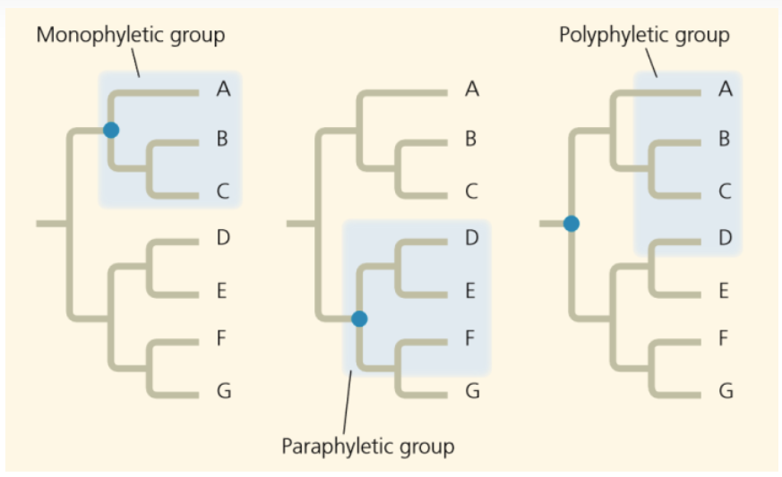
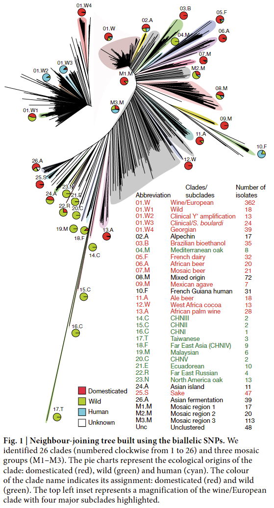
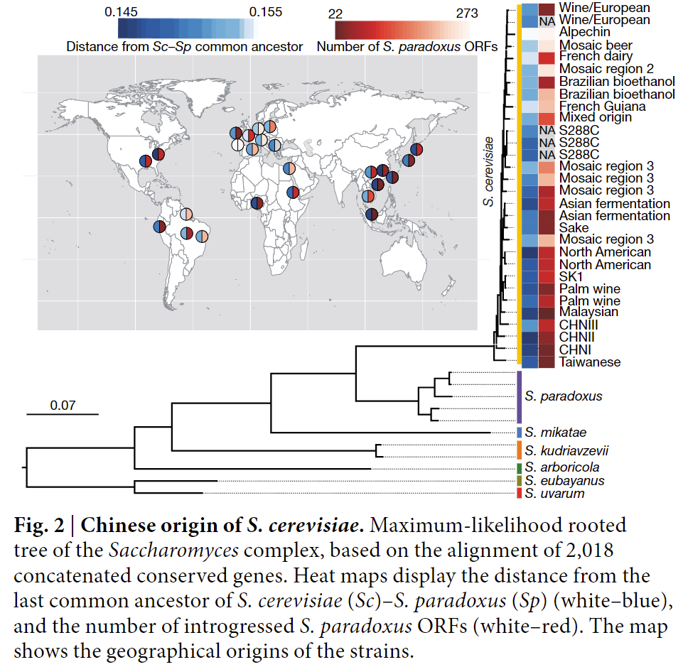
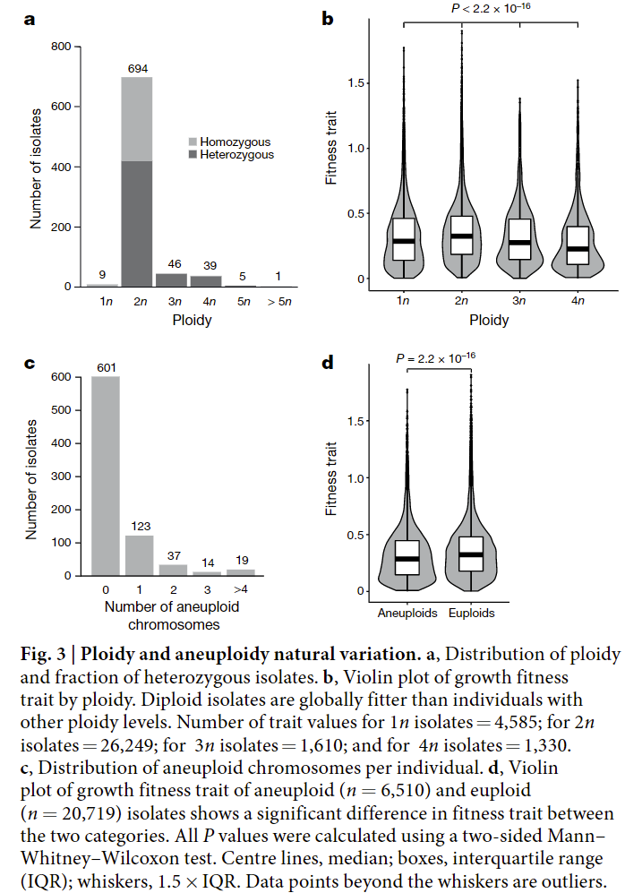
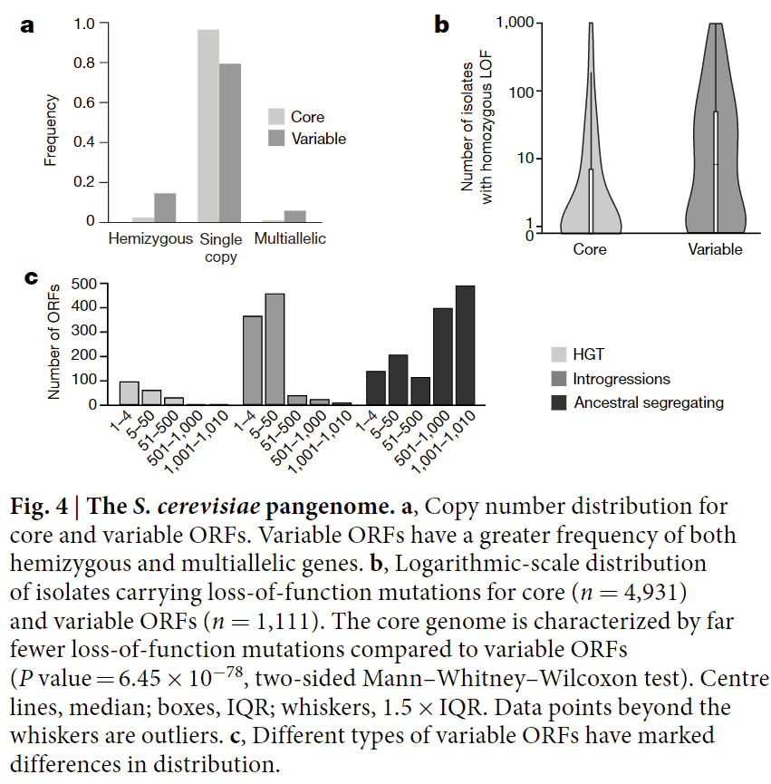
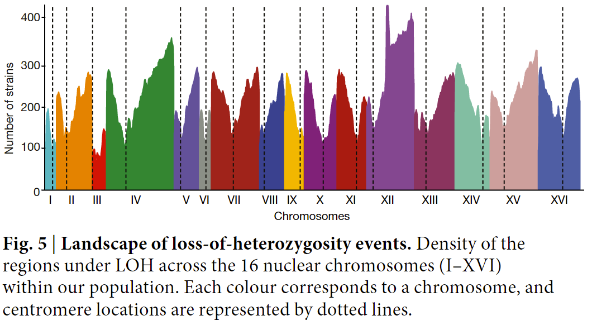
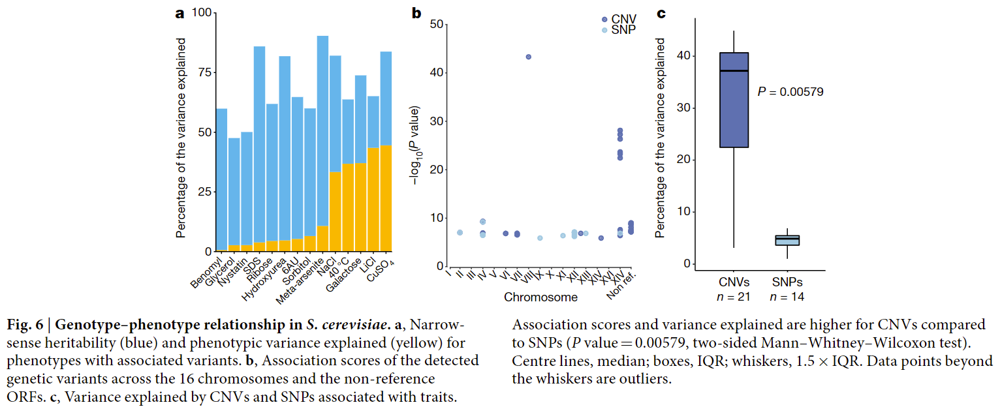

# Genome evolution across 1,011 Saccharomyces cerevisiae isolates

## 一、背景
### 1.1 基因渗入（Introgression）
两个基因库之间的基因流动，通常是经过种间杂交产生。基因渗入是一个长期的过程。

## 1.2 遗传力（Heritability）
又称遗传率。遗传力是指遗传方差在表型方差（总方差，即遗传方差与环境方差的和）中所占的比例。分为广义遗传力和侠义遗传力

性状由遗传因素和环境因素的共同作用而决定，遗传力表示性状受到遗传调控的比例，遗传力越大，说明性状的决定过程中遗传因素占比越大。

广义遗传力：表型方差中遗传方差所占的比率

侠义遗传力：表型方差中加性方差所占的比率

表型方差：群体中数量性状表型值的方差

遗传方差：群体内个体间基因型差异引起的变异量

加性遗传方差：在数量性状中，每对等位基因的作用有积加的效应，
如控制高度的基因，一个等位基因g 平均可贡献2cm的高度，G平均贡献4cm的高度，gg纯合贡献4cm，Gg杂合可贡献6cm，或者7cm，8cm，GG纯合可贡献8cm的，
它们的遗传方差称为加性遗传方差

## 1.3 双等位基因SNP（Biallelic SNPs）
双等位基因：表示在基因组的某个位点上有两个等位基因(第7个位点中的G和-)。

|| 1 | 2 | 3 | 4 | 5 | 6 | 7 | 8 | 9 |
| ---| --- | --- | --- | --- | --- | --- | --- | --- | --- |
| Reference | A | T | A | T | A | T | G | C | G |
| Sample 1 | A | T | A | T | A | T | - | C | G |
| Sample 2 | A | T | A | T | A | T | - | C | G |
| Sample 3 | A | T | A | T | A | T | - | C | G |
| Sample 4 | A | T | A | T | A | T | G | C | G |
| Sample 5 | A | T | A | T | A | T | G | C | G |

双等位基因SNP：从理论上来看每一个SNP 位点都可以有4 种不同的变异形式,但实际上发生的只有两种。SNP 在CG序列上出现最为频繁，而且多是C转换为T；大多数情况下,C都是变成T,而变成A和G的概率很小,所以一般认为SNP是二等位的。

## 1.4 酵母 2μ 质粒
几乎所有的酿酒酵母菌株中都存在一个6318bp大小的野生型2μ双链环状质粒，它在宿主细胞核内的拷贝数可维持在500-100之间，呈核小体结构，其复制的控制模式与染色体DNA完全相同。

2μ质粒上含有两个相互分开的599bp长反向重复序列（IRs），两者在某种条件下可发生同源重组，形成两种不同的形态（A和B）。该质粒只携带与复制和重组相关的4个蛋白质基因，不赋予宿主任何遗传表型。

## 1.5 单系群、并系群和复系群

单系（monophyletic）：包含一个共同祖先及其所有后代的集合

并系（paraphyletic）：包含一个共同祖先及其部分后代的集合

多系、复系（polyphyletic）：如果一个分类群包含的成员来自于两个或多个分支，且没有包含所有成员的最近共同祖先

## 二、技术方法

## 三、实验结论
### 3.1 图 1（使用双等位基因 SNP 构建的邻接树）

左上角的图是第一个簇的放大图，只要由欧洲白酒中的酵母构成

图中可以清楚的看到所选取的酵母一共分成了26个明显的枝以及3个mosaic枝，饼图表示不同枝的生态起源。可以观察到野生的酵母菌株和驯化的酵母菌株分布在进化树的两侧，中间有三个mosaic枝分隔开来，同时清酒中的菌株（25.S）与野生菌株SNP突变较为相似而地中海橡树菌株（04.M）与驯化菌株中的SNP较为相似。其中来自台湾的菌株（17.T）与其他菌株的SNP具有较大的差别，主要表现在 2μ 质粒上的差异大。

### 3.2 图 2（酿酒酵母的中国起源，基于 2,018 个串联保守基因做的最大似然有根树）

与外类群（S.paradoxus 酵母属相关的物种）最相近酿酒酵母来自台湾，并且东亚的菌种中具有更多的S.paradoxusORFs,说明酿酒酵母的起源很有可能来自台湾。

### 3.3 图 3（倍性和非整倍性的自然变异，217个菌株经过基因操作，不再处于自然倍型状态）

a：酵母倍性分布和杂合分离株的分数。大部分酵母为二倍体，并且以杂合子居多，也有少部分酵母为多倍体，多倍体的酵母基本上都是杂合子，对于其生态起源进行分析，发现多倍体在特定亚群（啤酒、棕榈酒）中分布，说明一些与人类有关的环境对倍性具有影响。

b：不同倍性的生长适应性（growth fitness trait）。与其他倍性相比，二倍体的酵母具有普遍的生长优势（二倍体具有有丝分裂的生长优势）。

c：每个个体非整倍染色体的分布。比较发现，非整倍染色体大多发生在1、2、3号染色体上，仅仅与染色体大小微弱相关。

d：非整倍体与整倍体的生长适应特征比较。整倍体与非整倍体相比具有显著的生长优势，说明非整倍事件的发生是具有适应代价的。

### 3.4 图 4（酿酒酵母的泛基因组）

通过这1011个酵母菌株对酿酒酵母的泛基因组进行分析，发现了 7796 个开放阅读框，其中 4940 个处于核基因组中，其余的在不同种群中的拷贝数不同。

a：核心和可变ORF的拷贝数变异。大部分核心ORF以单拷贝的形式存在而可变的ORF则表现出高频率的变异，以半合子和多拷贝的形式存在。

b：功能丧失突变在核心和可变ORFs上面的分布（对数）。比较发现，可变的ORFs上面分布了较多的功能丧失突变，选择性约束的差异？

d：不同类型的可变ORF再分布上有显著的差异。为了探究不同ORF的来源，对每个单独的ORF进行系统发育进化分析，将其分为了三类（水平基因转移、基因渗入、从祖先继承）；研究发现水平基因转移而来的基因主要存在于 Torulaspora 和 Zygosaccharomyces 中，他们与酿酒酵母共同存在于发酵环境中，并且鉴定的HGT片段较短，可能是由于多独立重排？事件造成；基因渗入的片段倾向于去取代酿酒酵母中的同源片段，表明他们是通过同源重组整合而来。

### 3.5 图 5（杂合性丢失loss of heterozygosity, LOH事件图谱）

酿酒酵母是高度自交的物种，杂交对基因组的变异有着很大的影响；通过标注LOH区域，可以确定杂合水平。

16 条核染色体上 LOH 区域的密度,虚线表示着丝粒的位置。LOH事件在基因组上的分布并不是均匀的，表现为越靠近着丝粒区域（重组少），LOH分布的越少，越靠近染色体末端，LOH的分布越多。

### 3.6 图 6（基因型和表型之间的关系）

a：侠义遗传力（蓝）和表现变异解释（表型变异对特征的影响，黄）具有相关变体的表型。对于后5个性状，解释的表型变异大于25%，说明表型的变异对这些特征的影响较大。

b：利用混合模型关联检测到了35个遗传变异（22个CNV和13个SNP），其中CNV的相关得分较高，说明CNV对表型的影响作用大。其中没有参考的ORF中也存在对表型影响较大的CNV，暗示了这些ORF潜在的作用。

c：与性状相关的CNV和SNP解释的方差。与SNP相比，CNV对性状变异的贡献更大。

