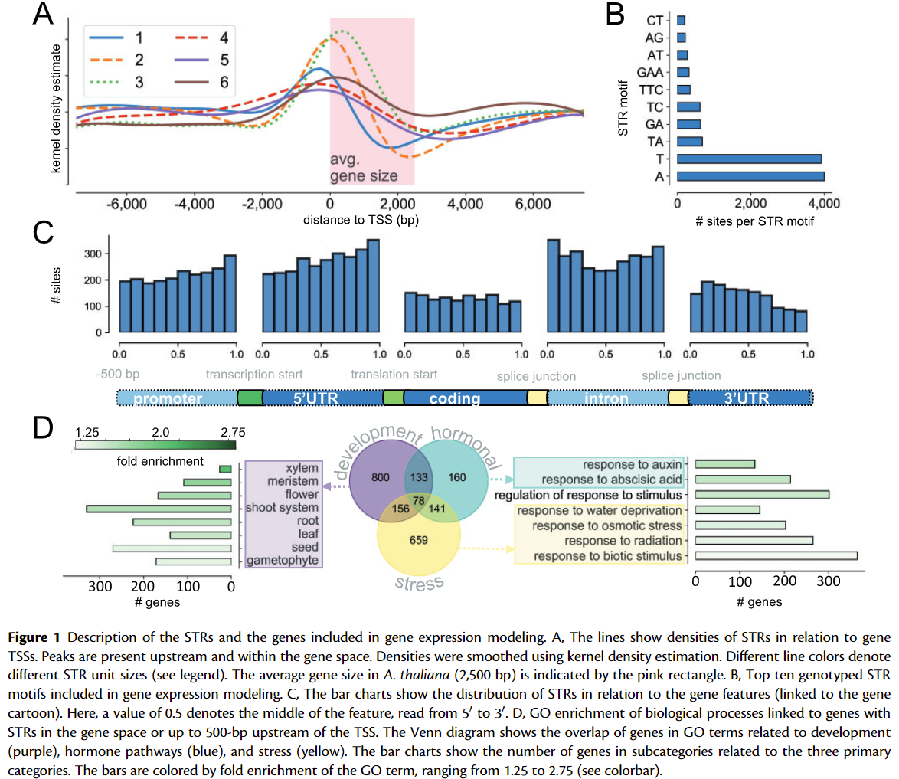
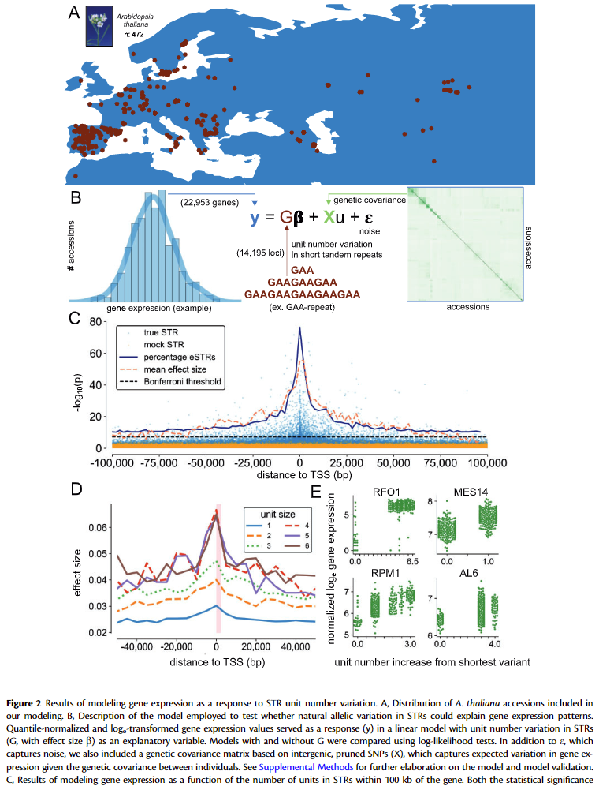
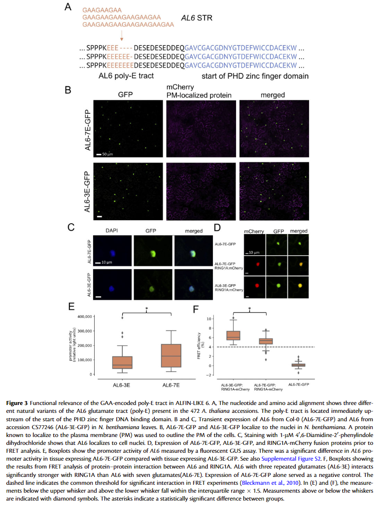

# Length variation in short tandem repeats affects gene expression in natural populations of *Arabidopsis thaliana*
## 一、研究背景
## 1.1 段串联重复序列（Short tandem repeats, STR）
也称为微卫星DNA（micosatallite DNA）,通常是基因组中由1~6个碱基单元组成的一段DNA重复序列。
STR序列符合孟德尔遗传定律，个体间存在相同的短串联重复序列，但重复的次数在个体间存在差异，形成片段长度不等的等位基因。
由于核心单位重复数目在个体间呈高度变异性并且数量丰富，构成了STR基因座的遗传多态性。

由于STR具有种类多、分布广泛、突变率低、多态性程度高等特点，被广泛应用于遗传制图。一般情况下，每一个STR位点会被约5-20％的人们所共有，当同时鉴别多个STR位点时，通过最终的STR图谱可以非常精确地鉴别每个个体。理论上联合应用16个STR位点，其个体的识别率可达0.999999999998，STR数量上突变的主要原因与DNA复制滑移（DNA replication slippage）有关。

## 1.2 Bonferroni校正
在同时对多组数据进行处理和比较的时候，很可能其中部分数据因为随机效应而超过阈值，造成假阳性结果。而检验的次数越多，出现假阳性的概率就越大。

Bonferroni校正即为最严格的多重检验矫正方法。其校正原理为：在同一数据集上同时检验n个相互独立的假设，那么用于每一假设的统计显著水平，应为仅检验一个假设时的显著水平的1/n。如以显著水平0.05检验同一数据集上两个独立的假设，此时用于检验该两个假设应使用更严格的0.025；对于10000个基因的检验，若将p设置为1e-6，进行10000次比较之后犯错误的概率是10-6\*10000 = 0.01，严格地控制了假阳性的出现。

## 二、一些工具
### 2.1 HipSTR(Haplotype inference and phasing for Short Tandem Repeats)
用于获得STR的基因型（genotyping STRs）

1. Learning locus-specific PCR stutter models using an EM algorithm

2. Mining candidate STR alleles from population-scale sequencing data

3. Employing a specialized hidden Markov model to align reads to candidate alleles while accounting for STR artifacts

4. Utilizing phased SNP haplotypes to genotype and phase STRs

### 2.2 [PANTHER数据库](http://pantherdb.org/)

相比采用的是基于隐马模型（HMM）的序列搜索手段，而且与直接使用GO数据库不同，PANTHER采用的是其自主整理的基因注释结构。
然后对基因进行聚类，但是PANTHER也存在一个问题，就是其提交的序列需要是蛋白序列，而非核酸序列，因此在使用转录组数据的时候，需要事先对序列进行转化。

## 三、结论
### 3.1 图1（基因表达模型中包含的STR和基因的描述）

A：STR在转录起始位点（TSS）附近的分布情况，不同颜色表示不同大小的STR片段，粉色的区域表示拟南芥中平均的基因大小（2500 bp）。不同大小的STR在基因上游（TSS位点）有着一个明显的富集，说明STR对基因表达的调控可能通过影响启动子来实现。2bp大小的STR相比于其他STR更加靠近TSS位点，而3bp大小的STR主要存在于基因中。

B：STR的motif排名情况。最常见的STR为dimer STR(1bp)中的A和T，在Trimer STR中，最常见的motif为TTC和GAA。总的来说，STR的motif中很少出现CG，是否是因为CG对比较稳定？

C：不同基因区域上面的STR分布情况。STR在编码区和3’UTR区分布较少，而在其他区域分布较多。并且在启动子区域中，STR倾向于往转录起始位点聚集而在5'UTR中STR则倾向于往编码区聚集，不同的区域，STR的聚集有不同的偏好性，STR的分布不是根据基因上面的位点而来的，而可能是通过特定的区域。

D：分析发现有7692个基因上游500bp有着共同的STR片段，对这些基因进行GO分析，发现这些基因主要与植物发育、激素途径以及胁迫有关。这表明STR的分布并不是随机。他们与植物的生长发育以及适应外界环境有着重要的关系。

### 3.2 图2（将STR单元的长度与基因表达量两者建模）

A：对拟南芥1001基因组测序的1135个植株数据进行质控后得到770个高质量序列，这770个植株中有472株有着莲座叶的转录组数据，取这472个植株的数据进行后续的分析，并标注了这472个序列在地理位置上的分布。

B：基因表达水平（y）与STR单元重复数量（G）、随机误差（e）和遗传协方差矩阵genetic covariance matrix?（X）之间的多元线性关系。X用来代表个体之间的遗传差异带来的基因表达的差异，用来掩盖样本之间本身的差异从而突出G与y的关系。

C：基于假设：STR距离一个基因越近，他对这个基因的影响就越大。用上述的模型探究了基因表达和这个基因100kb范围内的STR单位数量的影响。数据证明了假设的成立；通过将这些SIR打乱？（shuffled）后进行测试，发现665330个测试中，没有一个符合检验标准（Bonferroni），进一步证明了这些STR并非是随机分布的。

D：效应强弱（effective size）和STR单元大小的关系。越靠近TSS位点，STR的作用效果越明显；并且STR单元的大小越大，其作用也越明显。

E：STR 中的单元数与基因表达之间的关联示例。选取的四个案例表明，eSTR(effective STR)对基因的表达具有远端和近端的影响（distal and local effect）,eSTR单元复制数量的增加对下游基因的表达具有显著的影响，哪怕是单一motif的STR（T），STR增加之后对后续的基因表达都产生了显著的影响（横坐标中为什么会存在增加0.5个单元的情况？）携带短 poly-E 束的种质比具有较长 poly-E 束的种质具有更低的基因表达水平

### 3.3 图3（）

前提假设：由于 STR 编码的氨基酸链的长度变化而改变的蛋白质功能可能会导致对启动子活性的反馈

实验验证：GAA-eSTR in *AL6*，由于GAA存在于基因的编码区，这就导致多个GAA的重复最终导致编码的蛋白中产生一连串的E（谷氨酸）

A：核苷酸和氨基酸比对显示了472个拟南芥种质中存在的AL6谷氨酸链(poly-E)的三种不同天然变体。poly-E束位于PHD锌指DNA结合结构域起点的上游。

