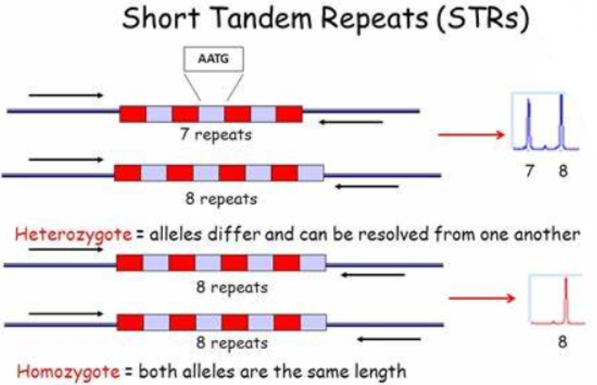

# Length variation in short tandem repeats affects gene expression in natural populations of *Arabidopsis thaliana*
## 一、研究背景
## 1.1 段串联重复序列（Short tandem repeats, STR）
也称为微卫星DNA（micosatallite DNA）,通常是基因组中由1~6个碱基单元组成的一段DNA重复序列。
STR序列符合孟德尔遗传定律，个体间存在相同的短串联重复序列，但重复的次数在个体间存在差异，形成片段长度不等的等位基因。
由于核心单位重复数目在个体间呈高度变异性并且数量丰富，构成了STR基因座的遗传多态性。

由于STR具有种类多、分布广泛、突变率低、多态性程度高等特点，被广泛应用于遗传制图。一般情况下，每一个STR位点会被约5-20％的人们所共有，当同时鉴别多个STR位点时，通过最终的STR图谱可以非常精确地鉴别每个个体。理论上联合应用16个STR位点，其个体的识别率可达0.999999999998。

## 二、一些工具

## 三、结论

