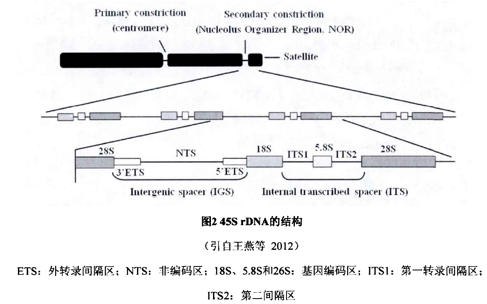
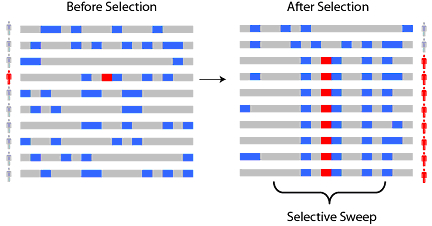
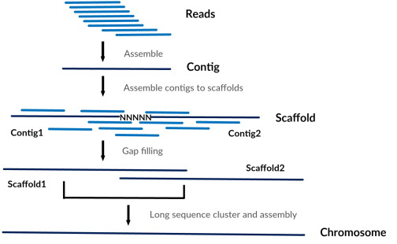
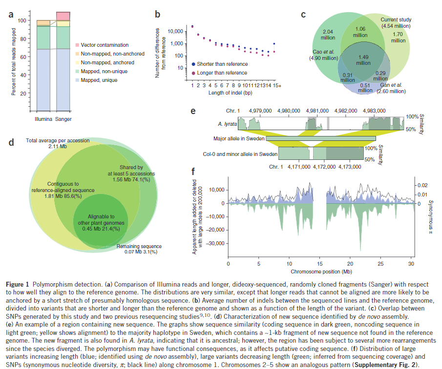
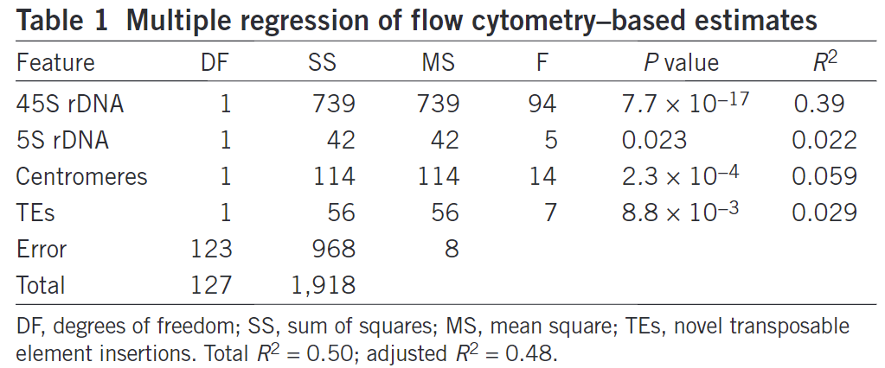
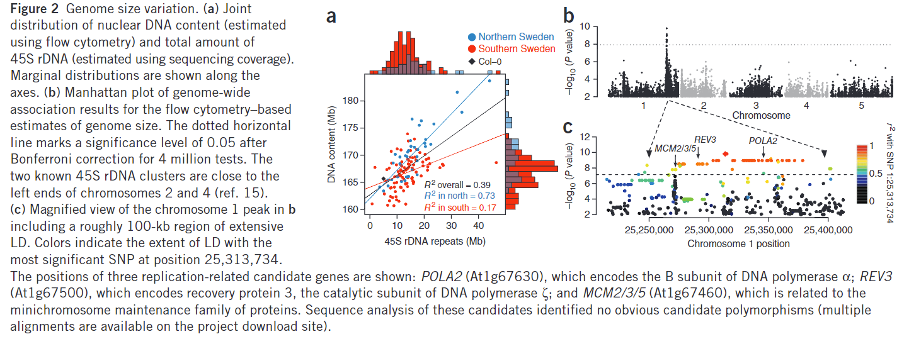
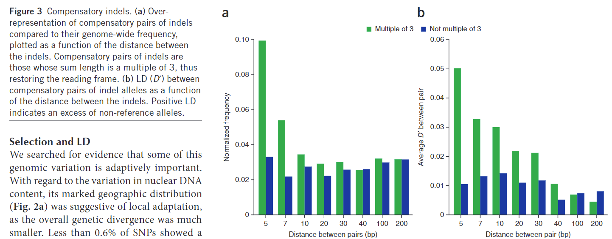

# Massive genomic variation and strong selection in *Arabidopsis thaliana* lines from Sweden
## 一、背景
### 1.1 45S rDNA
真核生物的核糖体由60S和40S大小亚基组成。构成核糖体亚基的主要成分是核糖体RNA（rRNA）与蛋白质的复合物，
核糖体RNA基因，称为rDNA，他在真核生物中高度保守。

真核生物的rRNA有四种类型（18S、5.8S、28S、5S），分别由45S rDNA和5S rDNA编码。
45S rDNA是串联重复序列，由18S rDNA基因开始，5.8S rDNA基因、28S rDNA基因、内转录间隔区（ITS）和ITS2组成一个重复单元。

虽然45S rDNA在序列上高度保守，但即使在情缘关系较近的种间或者种内，45S rDNA为带你在染色体上的位置和拷贝数也存在差异。

### 1.2 连锁不平衡（linkage disequilibrium,LD）
不同基因座（loci）的等位基因（allele）之间的非随机(nonrandom)关联

The nonrandom association of alleles at different loci

当两个位点的不同等位基因的关联频率高于或低于独立随机关联的条件下的期望频率时，就称两者是连锁不平衡的。这可能是由于两个位点在染色体上的距离足够近，从而导致连锁遗传的现象。在表达连锁不平衡的程度时，一般采用D，D'和r2.假设有两个连锁的座位A和B，其等位基因分别为A、a和B、b，4个等位基因的频率分别为P(A)、P(B)、P(a)、P(b)：

（1） D = P(AB) - P(A)P(B)

若D值偏离0，则说明存在LD

（2） D' = D / Dmax

当 D<0，Dmax=min{P(A)P(B),P(a)P(b)}； 

当 D>0，Dmax=min{P(A)P(b),P(a)P(B)}； 

当D'=1，表示连锁完全不平衡，没有重组；当D'=0，表示连锁完全平衡，随机组合；但是当|D'|<1 时，D'的值到底表示多大程度的连锁不平衡，是无法做出准确判断的。

（3） r2 = D * D / (P(A)P(a)P(B)P(b))

当r2=1，表示连锁完全不平衡，没有重组，当r2=0，表示连锁完全平衡，随机组合。

### 1.3 补偿突变（Compensatory mutation）
纠正早期突变导致的适应性（fitness）丧失的突变

### 1.4 选择扫荡（selective sweep）
由于某一位点受到强选择后，其周围的位点的多态性因受改位点牵连而发生多态性降低的现象

某个位点发生突变，突变后的位点因对物种在特定的情况下有利或者受到了人为的选择，那么该突变位点在群体中的频率必然提高，但是其附近和它处在同一个单体型或者block的其他的多态位点同样跟着受到了选择，频率发生了提高，也就是该单体型内的其他多态位点的某一多态形式比率大大提高，从而降低了整个周围区域的多态性。

### 1.5 琴叶拟南芥（*Arabidopsis lyrata，A. lyrata*）

一千万年前从原始8倍体拟南芥分化出来，在拟南芥的进化历史中，由于早期拟南芥杂交派生出了新的进化品种——琴叶拟南芥（Aly）。该品种的基因组更接近古早拟南芥物种，但是远大于当代拟南芥（Ath）基因组，且属于自交不亲和多年生植物。Aly的基因组与Ath基因组的巨大差异对于拟南芥基因组在常规进化过程中序列大量丢失、形成Ath种的演变历史具有很强的指导意义

### 1.6 从头组装（*de novo* assembly）
基因组测序数据的从头组装过程，可简单描述为：reads---->contig---->scaffold---->chromosome，具体如下所示：

首先基因组测序产生reads，然后对reads进行组装产生长片段Contigs，再确定Contig的方向和顺序，组装产生更长的片段Scaffolds，最后再组装连接Scaffold得到完整的染色体序列。

## 二、一些工具
### 2.1 QTLs（Quantitative trait loci,数量性状基因座）

数量性状：个体间的差异只能用数量来区别，变异呈连续性的性状

QTL：控制数量性状的基因的基因组中的位置

## 三、结论
### 3.1 图1（多态性检测）

a：Illumina测序与Sanger测序（长片段）结果，他们与参考基因组相比的匹配程度。总体匹配程度相似，除了Sanger测序中一些未能匹配到参考基因组上面的长片段可能被一小段推测的同源序列锚定（anchored by a short stretch of presumably homologous sequence?）

===>更具现有技术所发现的拟南芥中遗传多态性还不完全

b：与参考基因组indel片段长度相比，将检测到的indel片段分成了两类，shoter和longer，随着indel长度的增加，与参考基因组相比，发现了更多的shorter片段，并且shorter与longer之间的数量差异越来越大

c：此次试验确定的SNP与前人研究结果的韦恩图，由于前人样本的数量较少，并且样本中所含有的瑞典株系也较少，所以与前人研究相比，此次研究发现了更多的SNP这可能与种群结构有关系

d：作者将测序获得的序列进行了重新组装后于现有的参考基因组相比，发现了一部分新的序列，并且探寻了这些新序列的特征。大部分新序列在至少五个种质中共有,并且可以被与参考基因组良好对齐的序列锚定（anchor),说明这些新序列是真实存在于拟南芥中的，并非是实验误差。除此之外还有一部分序列（21.4%）可以在别的植物基因组中被检测到，这可能是保留的祖先片段？（retained ancestral fragments？）

e：对一段含有新序列的区域进行分析。在琴叶拟南芥中发现了新的序列，说明他们可能是保留的祖先片段；新基因在基因组上面的分布与测序缺失的区域的分布基本上一致

f：根据从头组装所鉴定的新基因，regions of missing coverage以及SNP在染色体区域上面的分布，前两者之间的分布与SNP相似，说明他们受到相似的选择压力

### 3.2 表1（基于流式细胞仪估计的多元回归）与图2（基因组大小的差异）

将45S rDNA、5S rDNA、着丝粒重复和转录因子作为自变量，利用多元线性回归去预测基因组的大小，结果显示，45S rDNA对于基因组的大小影响最大

a：瑞典南部和北部拟南芥种质45S rDNA重复的大小与核基因组大小的关系。首先，他们是呈现一个正相关的关系的，并且瑞典北部的种质相比于瑞典南部具有更多的45S rDNA重复以及更大的基因组大小，除此之外，他们之间的关联性在瑞典北部更为显著（R2 = 0.73）

b：在不同的植株和组织中都发现了这种基因组大小的差异，断定这种现象是可以遗传的，利用GWAS分析来探究其背后的原因。GWAS结果显示，45S rDNA的两个基因簇（2号染色体和4号染色体的左边）与基因组大小并没有存在显著的关联，发现一号染色体上有一部分突变位点与基因组大小存在显著的关系。

===> 虽然45S rDNA重复可以影响基因组大小，但GWAS显示其上面的变异（SNP）与基因组大小并不存在显著的关系，所以另存在相关的调控元件去影响45S rDNA重复，从而影响基因组大小（trans）

c：对上面的GWAS峰进行了更细致的分析。颜色代表了这些SNP与最显著的SNP之间的连锁不平衡关系，突出显示了三个与复制相关的基因，*POLA2*（编码DNA聚合酶α的B亚基），*REV3*（编码DNA聚合酶ζ的催化亚基）以及*MCM2/3/5*（微染色体维持蛋白家族）。

### 3.3 图3（补偿性插入缺失）

