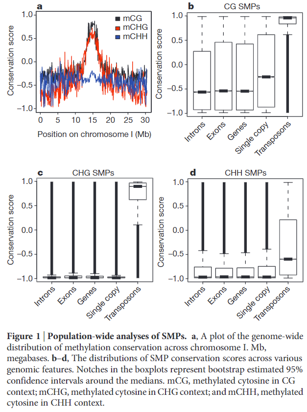

# Patterns of population epigenomic diversity
## 1 背景
### 1.1 RNA 介导的 DNA 甲基化（RNA-directed DNA methylation，RdDM）
siRNA（small interfering RNAs）介导的 DNA 甲基化是植物表观遗传的主要途径，主要依赖于两个植物特有的 RNA 聚合酶 Pol Ⅳ 和 Pol Ⅴ 以及大量的辅助
蛋白构成。RdDM可以在转录水平抑制转座子，基因（表达），参与到了植物抗病，胁迫应答，再生以及与等位基因间（interallelic）和细胞间的通信。

大致原理：RNA聚合酶Pol IV和Pol V在RdDM途径中分别负责产生小干扰RNA（small　interfering　RNAs，siRNAs）和
长非编码RNA（Long Intergenic Noncoding RNAs， IGN RNAs）。siRNA和AGO4结合并与IGN RNA互补配对，
招募甲基转移酶DRM2（Domain Rearranged Methyltransferase 2）至靶标位点建立DNA甲基化。

## 2 技术方法

## 3 结论
### 3.1 图 1（种群的 SMPs 分析）

单甲基化多态性（single methylation polymorphisms，SMPs）

a：为了确定 SMP 多样性的模式，计算了1号染色体不同位置的甲基化状态的保守性（Conservation score）。可以观察到 mCHH 在染色体不同区域的保守型没有太多差别，在1号染色体上 15Mb 左右的位置上，甲基化的保守性较高（着丝粒？），mCG 上的保守性相对于另外两种序列上的保守型高。

b-d：SMP 保守性在各个基因组注释区域的分布。

