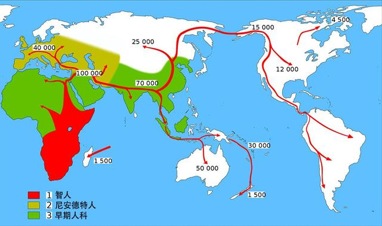
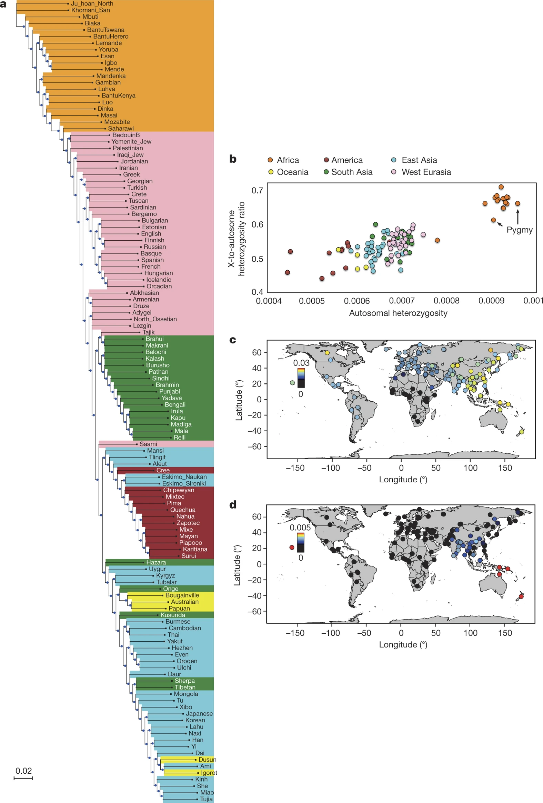
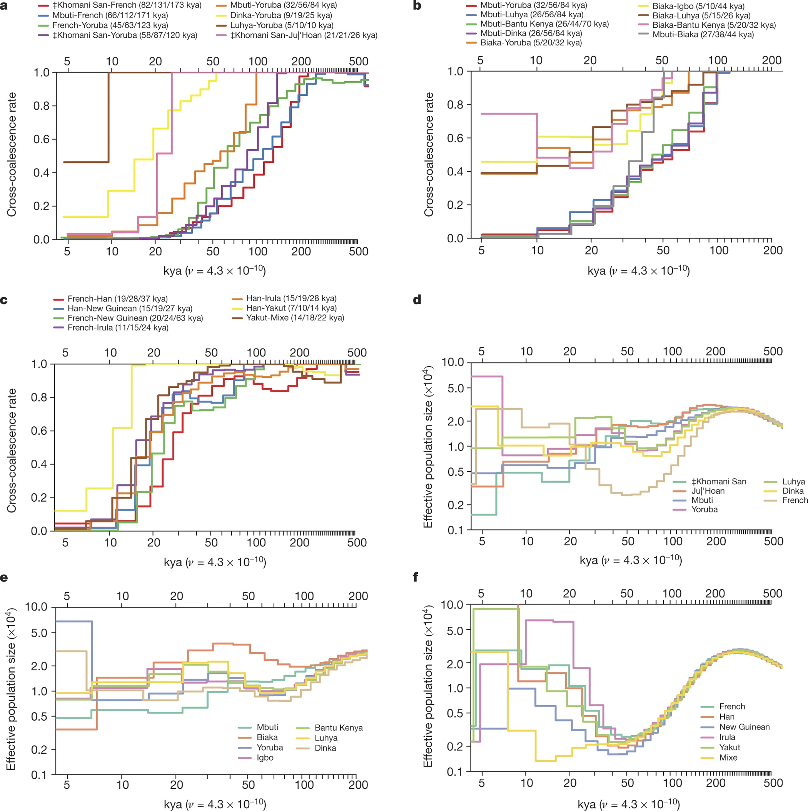

# The Simons Genome Diversity Project: 300 genomes from 142 diverse populations

## 1 背景
### 1.1 behavioural modernity（行为现代性）
+ 概念

现代人类进化史的一个重要里程碑，用于区分现在的人类和他们最近灵长祖先和已灭绝的古人类的特征，表现为现代人对于抽象思维的依赖和表达文化的创造力

现代人类行为的两大理论：

行为现代性发生于史前大约5万年前，可能是重要的基因突变或大脑的生物重组导致出现现代人类的自然语言

现代人类的行为是由于人类成千上万年的知识、技能和文化的逐渐积累而进化的结果

### 1.2 澳大利亚土著、新几内亚人、安达曼人

居住在岛屿（隔离？）

### 1.3 SGDP：Simons Genome Diversity Project
+ 优点（相较于1000 Genomes Project）

关注了人口较少的群体

测序深度更深

### 1.4 尼安德特人和丹尼索瓦人

当前全世界的人类有着共同起源，都是来自于20万年前的非洲智人。距今7万年左右，一部分智人离开了非洲。当他们到达亚洲时，与早已生活在欧亚大陆的尼安德特人相遇。

+ 尼安德特人

尼安德特人于43万至80万年前出现在欧亚大陆上,其祖先可以推溯至约40~60万年以前的海德堡人，在大约3万年前灭，尼安德特人灭绝，在非洲之外的现代人类身上，科学家检测出了尼安德特人的基因，占比大约2%。这意味着两种人类之间曾经有过混血。现在所有的非非洲人都拥有尼安德特人血统。

+ 丹尼索瓦人

是生活在上一个冰河时代（3万年前）的人类种群，30万年前，丹尼索瓦人从原始尼人中分化出来，28万年前，他们到达辽宁金牛山地区。经过8万年的生存斗争，他们淘汰了本土的北京直立人，成为了东北亚地区的人类居民。之后他们在中华大地上反复迁徙，最终在2-3万年前消失在西伯利亚平原。澳大利亚-

## 二 一些工具
### 2.1 ADMIXTURE

种群结构分析软件：

根据多个个体的测序文件（SNP），将他们进行分类

### 2.2 PSMC（）

## 三 结论
### 图1（人类遗传多样性结构）

+ Fig1.a

基于pairwise divergence per nucleotide而构建的邻接树 

人类种群之间最深的分歧在非洲人群中（黄色部分，Ju_hoan_North -> Mbuti），东亚人（蓝）与非洲人（黄）差异较大而亚欧大陆人种（粉）与非洲人种相似度较高，大洋洲的人种（黄）与东亚人种（蓝）接近，推测东亚人迁移到大洋洲。

+ Fig1.b

纵：X染色体杂合性与常染色体杂合性比率，横：常染色体杂合性

与非洲人种相比，非非洲人种以及非洲人种中的pygmy人的X染色体杂合性与常染色体杂合性比率较低，这可能是由male-driven admixture造成的（男性人口流动，X染色体多样性降低？）

+ Fig1.c,d

c:尼安德特人血统统计

d:丹尼索瓦人血统统计

东亚人具有最高比例的尼安德特人血统；与其他欧亚人相比，南亚人有过丹尼索瓦血统，大洋州人有着最高的丹尼索瓦人血统。

### 图2（人类分离的时间进程）

